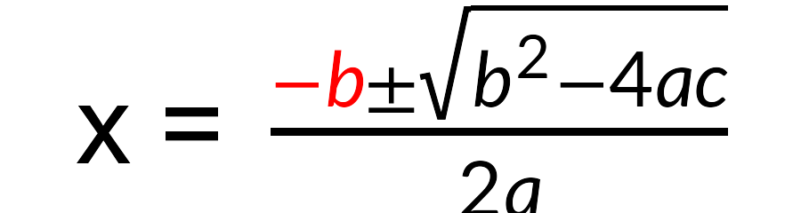
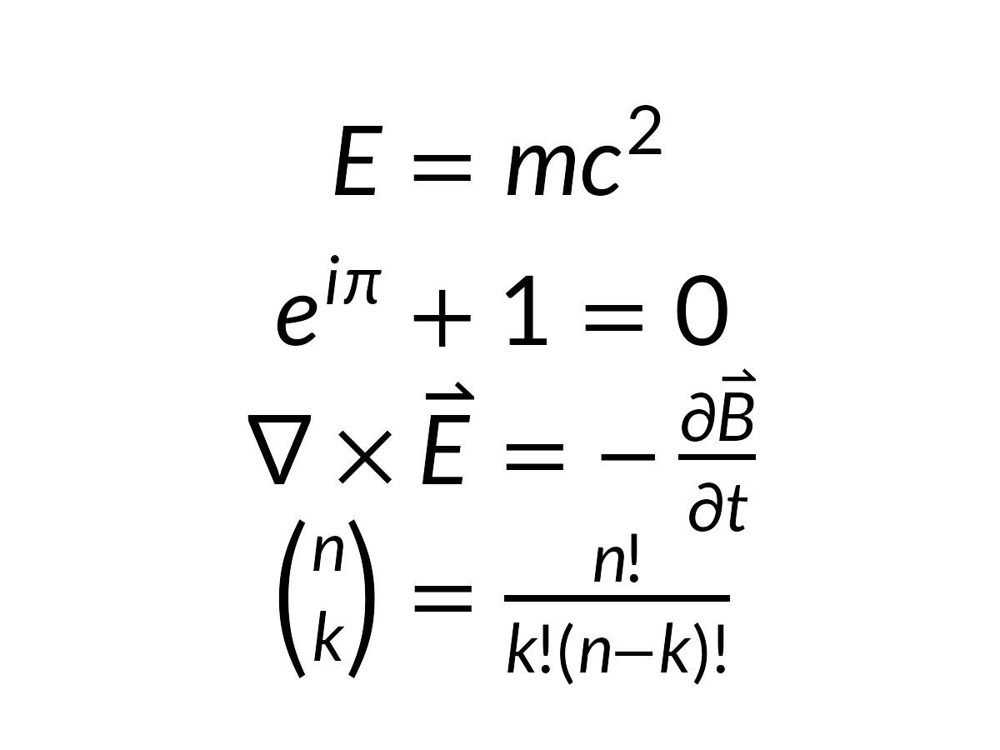
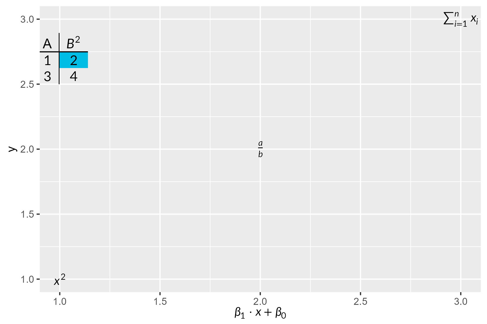

# gridmicrotex

<!-- badges: start -->

[](https://github.com/adayim/gridmicrotex/actions)
[](https://CRAN.R-project.org/package=gridmicrotex)
[](https://cran.r-project.org/package=gridmicrotex)
[](https://app.codecov.io/gh/adayim/gridmicrotex)
<!-- badges: end -->

Render LaTeX math expressions as native R **grid** graphics objects,
with no external LaTeX installation required.

gridmicrotex embeds the
[MicroTeX](https://github.com/NanoMichael/MicroTeX) C++ layout engine to
parse LaTeX, compute the full box model, and produce
resolution-independent vector output (paths, lines, rectangles) that
works on any R graphics device.

## Disclaimer

**A note on development**: This package was developed as a proof of
concept for AI-assisted package creation. I designed the architecture
and specification, and the core C++ integration (via
[MicroTeX](https://github.com/NanoMichael/MicroTeX)) was largely
facilitated by AI, with my review and oversight of the design and final
outputs. I am sharing it because it works, and I hope that others will
find it useful. Contributions, bug reports and improvements from the
community are very welcome.

## Installation

Install the development version from GitHub:

``` r
# install.packages("devtools")
devtools::install_github("adayim/gridmicrotex")
```

## Examples

``` r
library(gridmicrotex)
library(grid)

grid.newpage()
grid.latex("x = \\frac{\\textcolor{red}{-b} \\pm \\sqrt{b^{2} - 4ac}}{2a}", 
           gp = grid::gpar(fontsize = 30))
```



By default, the input is treated as LaTeX math mode (“mixed” mode),
which wraps non-math text in `\text{}` and preserves math expressions
as-is. Use `$...$` or `\\(...\\)` delimiters to render math. The
`"x = "` in the equation above treated as text. Use
`input_mode = "math"` to treat the whole string as math mode and render
text with `\\text{}`. You can change this with global option
`latex_options(input_mode = "math")`.

### Composing with other grobs

The grob can be placed alongside other grid objects:

``` r
latex_options(input_mode = "math")
g <- latex_grob("\\frac{a}{b}", gp = grid::gpar(fontsize = 30))
grid.newpage()
# A blue box behind the formula
grid.rect(
  x = 0.5, y = 0.5,
  width = grobWidth(g) + unit(10, "bigpts"),
  height = grobHeight(g) + unit(10, "bigpts"),
  gp = gpar(fill = "#e8f0fe", col = "#4285f4", lwd = 2)
)

# The formula itself
grid.draw(g)
```


### Multiple expressions

``` r
exprs <- c(
  "E = mc^{2}",
  "e^{i\\pi} + 1 = 0",
  "\\nabla \\times \\vec{E} = -\\frac{\\partial \\vec{B}}{\\partial t}",
  "\\binom{n}{k} = \\frac{n!}{k!(n-k)!}"
)

grid.newpage()
for (i in seq_along(exprs)) {
  grid.latex(
    exprs[i],
    x = unit(0.5, "npc"),
    y = unit(1 - i / (length(exprs) + 1), "npc"),
    gp = grid::gpar(fontsize = 28)
  )
}
```



### Mixed text and math

You can use `r"()"` raw strings to write LaTeX with regular newlines and
quotes without escaping. Use `\text{}` to embed regular text within math
expressions:

``` r
grid.newpage()
grid.latex(
  r"(f(x) = \begin{cases} x^2 & \text{if } x \geq 0 \\ -x & \text{otherwise} \end{cases})",
  gp = grid::gpar(fontsize = 26)
)
```


## CJK and multilingual text

Non-math text via `\text{}` supports CJK and other scripts. Font
settings from `gp` (`fontfamily`, `fontface`) apply to text only — math
rendering always uses the selected math font:

``` r
grid.newpage()
grid.latex(r"(\text{如果 } x > 0 \text{ 则 } y = x^2)",
           gp = gpar(fontsize = 24, fontfamily = "sans"))
```


## User-defined macros

Use `define_macro()` for zero-argument shorthands that persist across
plots in the session, and plain-TeX `\def` for parameterised macros
local to a single expression:

``` r
define_macro("RR", "\\mathbb{R}")
grid.newpage()
grid.latex(
  r"(\def\norm#1{\left\lVert #1 \right\rVert}
      \forall \vec{v} \in \RR^n,\ \norm{\vec{v}} \geq 0)",
  gp = grid::gpar(fontsize = 22)
)
```


``` r
clear_macros()
```

See `?define_macro` and `vignette("getting-started")` for details.

## ggplot2 integration

Use `geom_latex()` to place LaTeX labels at data coordinates, and
`element_latex()` for LaTeX-rendered axis titles:

``` r
library(ggplot2)
# Add a LaTeX table as an annotation
tab_str <- r"(\begin{tabular}{c|c} \text{A} & B^2 \\ \hline 1 & \cellcolor{#00bde5}2 \\ 3 & 4 \end{tabular})"

df <- data.frame(x = 1:3, y = 1:3,
                 eq = c("x^2", "\\frac{a}{b}", "\\sum_{i=1}^n x_i"))
ggplot(df, aes(x, y, label = eq)) + 
  geom_latex() +
  annotate("latex", x = 1, y = 2.7, label = tab_str, size = 12) +
  labs(x = "$\\beta_1 \\cdot x + \\beta_0$") +
  theme(axis.title.x = element_latex())
```



ggplot2 is a soft dependency — the core functions work without it. See
`vignette("ggplot2-integration")` for more examples.

## Comparison

| Approach         | LaTeX required? | Device independent? | Vector? | Math coverage |
|:-----------------|:---------------:|:-------------------:|:-------:|:-------------:|
| `tikzDevice`     |       Yes       |         No          |   Yes   |     Full      |
| `xdvir`          |       Yes       |         No          |   Yes   |     Full      |
| `latexpdf`       |       Yes       |         No          |   Yes   | Full (tables) |
| `latex2exp`      |       No        |         Yes         |   Yes   |    Limited    |
| `plotmath`       |       No        |         Yes         |   Yes   |    Limited    |
| **gridmicrotex** |     **No**      |       **Yes**       | **Yes** |   **Broad**   |

## How it works

1.  Your LaTeX string is parsed by MicroTeX’s C++ engine into a TeX box
    model
2.  A custom `Graphics2D` recorder captures every draw operation (glyph
    paths, lines, rectangles) with exact coordinates
3.  The layout crosses the C++/R boundary as a data frame
4.  R converts each record into native grid primitives (`pathGrob`,
    `segmentsGrob`, `rectGrob`)
5.  The result is a `gTree` that renders on any device at any resolution

By default, math glyphs are rendered in typeface mode as native text
using the selected math font, which keeps PDF/SVG output selectable and
searchable on devices with font embedding support.

When `render_mode = "path"` is used (or when automatic fallback is
triggered on unsupported devices), glyphs are drawn as filled vector
paths for consistent rendering everywhere.

Make sure to use `ragg::agg_png()`, `svglite::svglite()` or
`grDevices::cairo_pdf()` for best results, as some older devices may not
support the full range of path operations.

## Graphics backend

The default graphics device on Windows (`windows()`) and macOS
(`quartz()`) may not find the bundled math fonts, producing warnings
like:

    font family not found in Windows font database

To avoid this, switch to a modern graphics backend that uses
[systemfonts](https://CRAN.R-project.org/package=systemfonts) for font
resolution:

``` r
# For knitr / R Markdown — add to your setup chunk:
knitr::opts_chunk$set(dev = "ragg_png")

# For interactive use:
options(device = function(...) ragg::agg_png(tempfile(fileext = ".png"), ...))
```

Recommended backends:

| Backend | Format | Package |
|:---|:---|:---|
| `ragg::agg_png()` | PNG | [ragg](https://CRAN.R-project.org/package=ragg) |
| `svglite::svglite()` | SVG | [svglite](https://CRAN.R-project.org/package=svglite) |
| `grDevices::cairo_pdf()` | PDF | Base R (Cairo build) |

Alternatively, use `render_mode = "path"` to bypass font lookup entirely
— glyphs are drawn as vector paths, which works on all devices but
produces non-selectable text in PDF/SVG.
